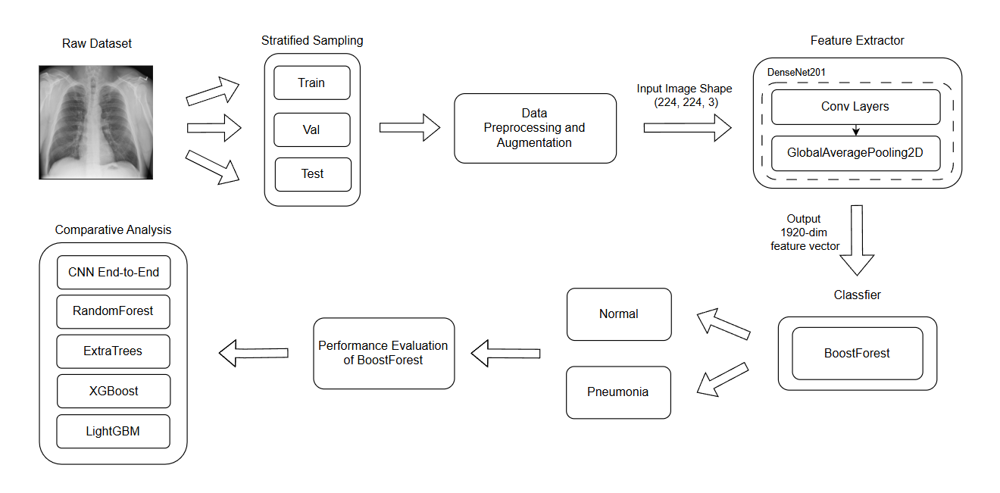
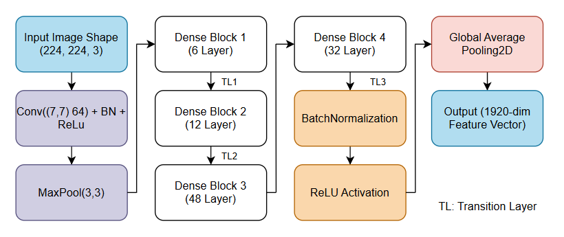
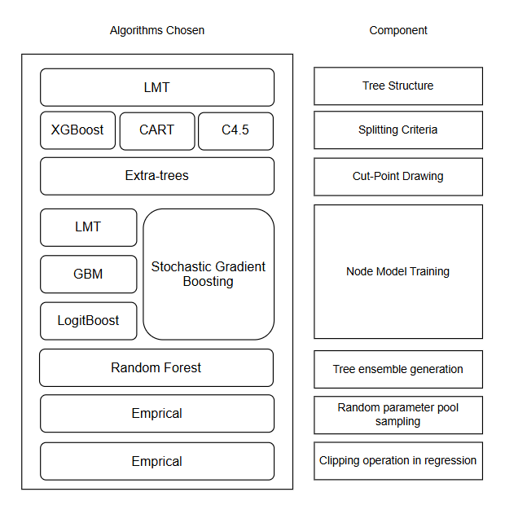
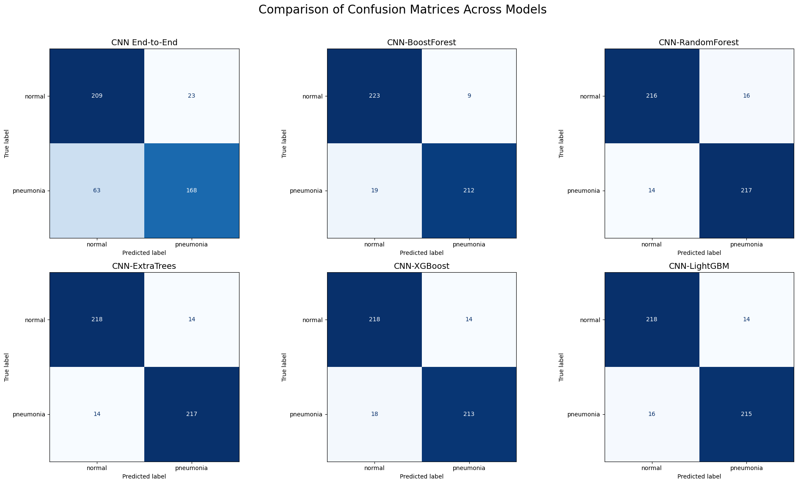
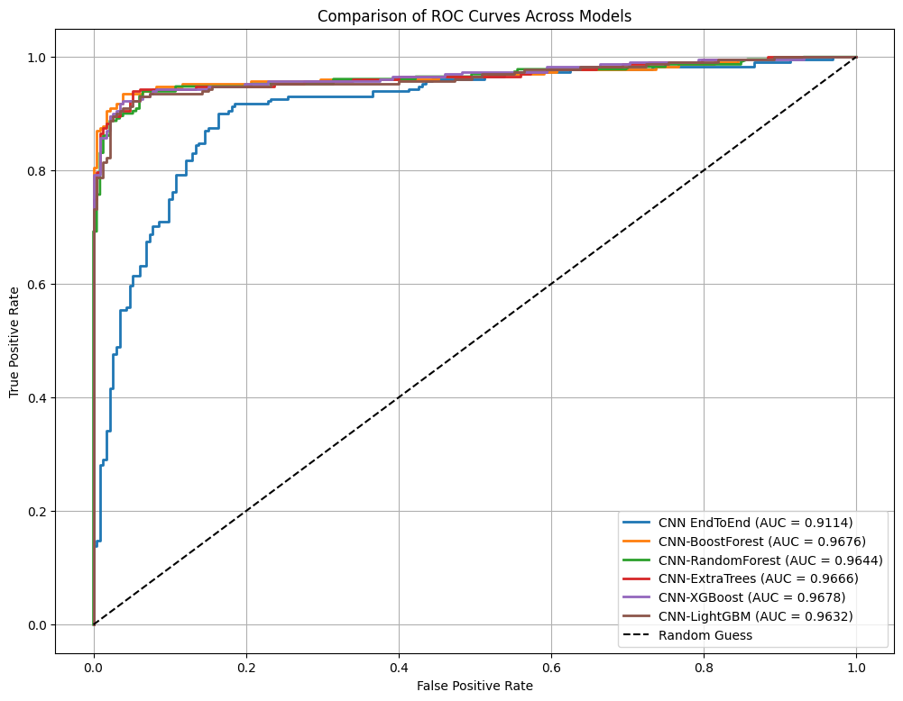

# CNN-BoostForest: A Synergistic Approach for Pneumonia Detection

**Authors:** Jazzlyn Amelia Lim, Cindy Noveiren
**Publication:** ICORIS 2025 - International Conference

---

## Overview
This project implements a **hybrid deep learning and ensemble learning model** for detecting pneumonia from chest X-ray images. We combine **DenseNet201** for feature extraction with **BoostForest** for classification, and compare its performance against:

- End-to-end CNN  
- CNN + Random Forest  
- CNN + Extra Trees  
- CNN + XGBoost  
- CNN + LightGBM  

**Highlights:**
- Achieved **93.95% accuracy**, **94.03% precision**, **F1-score 93.95%**, **AUC 0.97**  
- Hybrid CNN-BoostForest outperforms CNN end-to-end and is competitive with other CNN-hybrid models  
- Computationally heavier but offers strong predictive stability  

---

## Notebooks

1. **`Pneumonia_CNN.ipynb`** – End-to-end CNN training and evaluation  
2. **`Pneumonia_CNN_Hybrid.ipynb`** – Hybrid CNN ensemble models training, evaluation, and comparison  

---

## Methodology

**Workflow:**  

**DenseNet201 Feature Extractor:**  

**BoostForest Architecture:**  

**BoostForest Key Features:**
- Combines **bagging & boosting** in parallel  
- Randomized split points inspired by Extra Trees  
- Node models trained via gradient boosting & LMT  
- Hyperparameters tuned manually for balance between performance & computation
 
---

## Dataset
- **Source:** [COVID19 Pneumonia Normal Chest X-ray PA Dataset](https://www.kaggle.com/datasets/amanullahasraf/covid19-pneumonia-normal-chest-xray-pa-dataset/)  
- **Classes:** Pneumonia, Normal (Binary Classification)  
- **Split:** Training, Validation, Testing (balanced, stratified)
  
---

## Results

### Model Performance Comparison

| No | Model            | Accuracy (%) | Precision (%) | Recall (%) | F1-Score (%) |
|----|------------------|--------------|---------------|------------|--------------|
| 1  | CNN-RandomForest | 93.52        | 93.52         | 93.52      | 93.52        |
| 2  | CNN-ExtraTrees   | 93.95        | 93.95         | 93.95      | 93.95        |
| 3  | CNN-XGBoost      | 93.09        | 93.10         | 93.09      | 93.09        |
| 4  | CNN-LightGBM     | 93.52        | 93.52         | 93.52      | 93.52        |
| 5  | CNN End-to-End   | 81.43        | 87.96         | 72.73      | 79.62        |
| 6  | **CNN-BoostForest** | **93.95** | **94.03**     | **93.95**  | **93.95**    |

### Computational Cost

| No | Model            | Training Time (s) | Inference Time / Image (ms) | Model Size (MB) | Peak Memory (MB) |
|----|------------------|--------------------|-----------------------------|-----------------|------------------|
| 1  | CNN-RandomForest | 56.13             | 0.0798                      | 11.39           | 0.67             |
| 2  | CNN-ExtraTrees   | 9.77              | 0.0555                      | 20.54           | 0.52             |
| 3  | CNN-XGBoost      | 69.80             | 0.0150                      | 0.36            | 0.03             |
| 4  | CNN-LightGBM     | 9.79              | 0.0247                      | 0.19            | 1.66             |
| 5  | CNN End-to-End   | 25218.5           | 375.77                      | 91.34           | 208.37           |
| 6  | **CNN-BoostForest** | **26286.7**    | **8.67**                    | **85.72**       | **184.85**       |

### Confusion Matrix

### ROC AUC

### McNemar's Test

| Comparison                          | b  | c  | χ² (McNemar) | p-value      | Conclusion      |
|-------------------------------------|----|----|--------------|--------------|-----------------|
| CNN-BoostForest vs CNN End-to-End   | 64 | 6  | 46.4143      | 9.57e-12     | **Significant** |
| CNN-BoostForest vs CNN-RandomForest | 7  | 5  | 0.0833       | 0.77283      | Not significant |
| CNN-BoostForest vs CNN-ExtraTrees   | 6  | 6  | 0.0833       | 0.77283      | Not significant |
| CNN-BoostForest vs CNN-XGBoost      | 9  | 5  | 0.6429       | 0.42268      | Not significant |
| CNN-BoostForest vs CNN-LightGBM     | 7  | 5  | 0.0833       | 0.77283      | Not significant |

